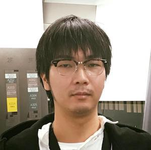

Akira Matsuda is currently a Ph.D. student at The University of Tokyo, He received his B.E. degree in computer science from Shibaura Institute of Technology and M.A.S. degree in interdisciplinary information studies from The University of Tokyo, in 2011 and 2017, respectively. His research interests include Human-Computer Interaction (HCI), Human Augmentation, Telepresence, and Telecommunication. He is focusing not only on communication by language but also on communication using nonverbal information such as eye contact, facial expression, and body cues.

[Resume](../assets/akira_matsuda.pdf), [ResearchGate](https://www.researchgate.net/profile/Akira_Matsuda5), [Github](https://github.com/0x0c), [LinkedIn](https://www.linkedin.com/in/akira-matsuda-425181140/), [Qiita](https://qiita.com/0x0c@github)

----

## Education

- **April 2017 - present**
  - Ph.D. candidate in Interdisciplinary Information Studies, Graduate School of Interdisciplinary Information Studies, The University of Tokyo, Tokyo, Japan
  - Supervisor: Jun Rekimoto

- **April 2015 - March 2017**
  - M.A.S. in Interdisciplinary Information Studies Graduate School of Interdisciplinary Information Studies, The University of Tokyo, Tokyo, Japan
  - Supervisor: Jun Rekimoto

- **April 2011 - March 2015**
  - B.E. in Computer Science, School of Engineering, Shibaura Institute of Technology, Tokyo, Japan
  - Supervisor: Hiroyuki Nakamura

## Academic Qualification

- **March 2017**
  - M.A.S. in Interdisciplinary Information Studies, Graduate School of Interdisciplinary Information Studies, The University of Tokyo, Tokyo, Japan

- **March 2015**
  - B.E. in Computer Science, School of Engineering, Shibaura Institute of Technology, Tokyo, Japan

## Publication
### International conference (oral / refereed)
- **Akira Matsuda**, Takashi Miyaki, Jun Rekimoto, **ScalableBody: A Telepresence Robot Supporting Face Position Matching using Vertical Actuator**. In Proceedings of the 8th Augmented Human International Conference 2017 (AH'17), 2017.
- Azusa Kadomura, **Akira Matsuda**, Jun Rekimoto. **CASPER: A Haptic Enhanced Telepresence Exercise System for Elderly People**. In Proceedings of the 7th Augmented Human International Conference 2016 (AH '16), 2017.
  - [Here](http://dx.doi.org/10.1145/2875194.2875197)
  - Acceptance Rate 15%

### Workshop (oral / refereed)
- **Akira Matsuda**, Jun Rekimoto. **ScalableBody : A Telepresence Robot with Vertical Actuation for Face-to-face Communication and Human Augmentation**. 1st Asian Workshop on User Interface (AUI 2016)

### International conference (oral / non-refereed)
- **Akira Matsuda**, Hiroyuki Nakamura. **Wearable Assistive Device Development Toolkit**. 31st Annual International Technology and Persons with Disabilities Conference.
International conference, 2016.
- **Akira Matsuda**, Jun Rekimoto. **ScalableBody: A Telepresence Robot Supporting Socially Acceptable Interactions and Human Augmentation through Vertical Actuation**. In Proceedings of the 29th Annual Symposium on User Interface Software and Technology (UIST '16 Adjunct), 2016.
  - [Here](http://dx.doi.org/10.1145/2984751.2985718 )

### International conference (Poster / refereed)
- **Akira Matsuda**, Midori Sugaya, Hiroyuki Nakamura. **Luminous device for the deaf and hard of hearing people**. In Proceedings of the second international conference on Human-agent interaction (HAI '14), 2014.
  - [Here](http://doi.acm.org/10.1145/2658861.2658922)
  - Acceptance Rate 44%

### Domestic conference (oral / non-refereed)
- **松田 暁**, 加藤 淳, 尾形 正泰, 濱崎 雅弘, 後藤 真孝, 暦本 純一. **同期的共同作業における作業者の存在感を増強するカーソル拡張型コミュニケーション手段**. 第4回 プログラミング体験勉強会(SIGPX) (口頭発表), 2018.
- **松田 暁**, 中村 広幸. **社会情報学研究のためのウェアラブルデバイス開発支援ツール**. 日本計画行政学会・社会情報学会共催 第9回若手研究交流会. (口頭発表), 2015.
- **松田 暁**, 中村 広幸, 菅谷 みどり. **Luminous Sound Indicator: 光を用いた音源を察知するための注意喚起デバイス**. HCI, ヒューマンコンピュータインタラクション研究会報告 vol. 2014 (25) p. 1-6. 情報処理学会研究報告. 第157回 ヒューマンコンピュータインタラクション研究会, 2014.

### Domestic conference (poster / refereed)
- 門村 亜珠沙, **松田 暁**, 暦本 純一. **CASPER: 高齢者のための空気砲 を用いた遠隔エクササイズシステム**. 第20回一般社団法人情報処理学会シンポジウム インタラクション2016, 2016. ***ベストインタラクティブ発表賞***
- **松田 暁**, 中村 広幸. **ウェアラブルデバイスのプロトタイピングを支援するツールキットの開発**. 第19回一般社団法人情報処理学会シンポジウム インタラクション2015, 2015.

## Grants
- Project Fund in Summer Founders Program organized by Division of University Corporate Relations (1,500 dolls)
  - The mission of the Division of University Corporate Relations (DUCR) is to increase accessibility to University of Tokyo research and, in order to build a foundation of mutual cooperation, to offer proactive support to both domestic and foreign industry.

## Professional Activities
### Meetups
- [UIST勉強会](http://uistudy.tokyo)

### Academic services
#### Reviewer
- CHI2017

## 資格
- 情報処理技術者試験 応用情報技術者(AP) 2012 秋期
- 情報処理技術者試験 情報セキュリティスペシャリスト(SC) 2013 秋期

## その他
- [Mashup Awards 2017 優勝](https://hacklog.jp/works/52199)
- [mixiカイハツコンテスト2011 優勝](http://everevo.com/event/492)

## Contact

- akira.matsuda.ut (at) gmail.com

